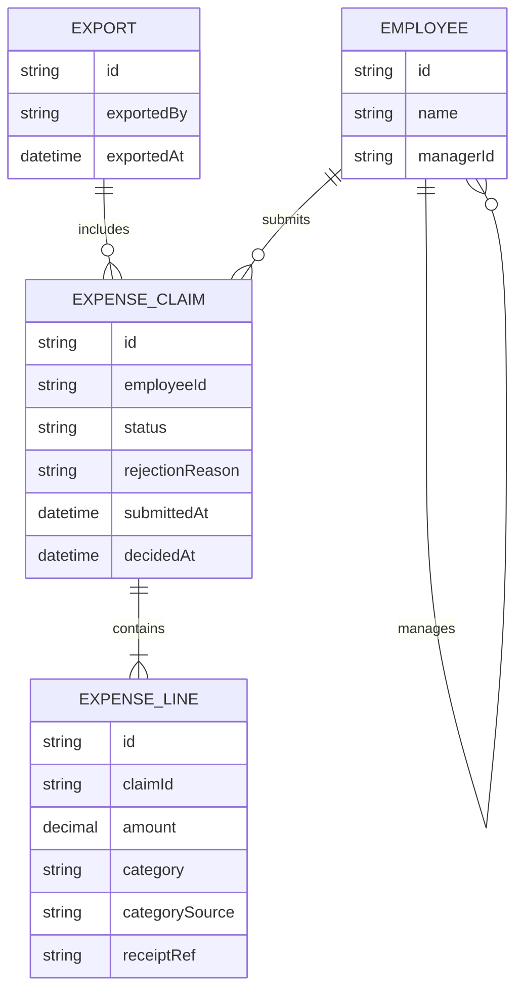

# Domain model

The core entities behind expense claims, their approval, and their export to payroll.

- **Employee** has at most one manager (`managerId`, self-relation), used to resolve a manager's team.
- **ExpenseClaim** status is one of `draft`, `pending`, `approved`, `rejected`, `exported`; `rejectionReason` is set only when rejected.
- **ExpenseLine** belongs to exactly one claim; `category` comes from the fixed built-in list; `categorySource` records whether the employee picked it or accepted the agent's suggestion; `receiptRef` is set when a receipt was attached (required above $25).
- **Export** groups the claims it swept up at the time finance ran it; an exported claim's status becomes `exported` and it is never included again.