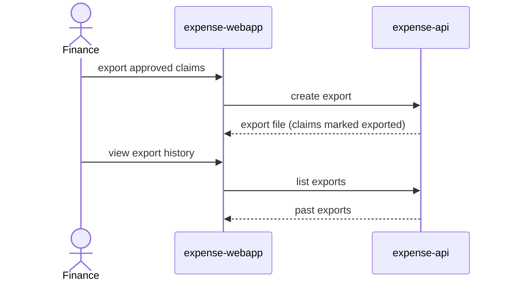

# Export approved claims to payroll

Finance sweeps up every approved claim not yet exported into a downloadable file, and later checks the export history.

```mermaid
sequenceDiagram
    actor Finance
    participant expense-webapp
    participant expense-api

    Finance->>expense-webapp: export approved claims
    expense-webapp->>expense-api: create export
    expense-api-->>expense-webapp: export file (claims marked exported)
    Finance->>expense-webapp: view export history
    expense-webapp->>expense-api: list exports
    expense-api-->>expense-webapp: past exports
```