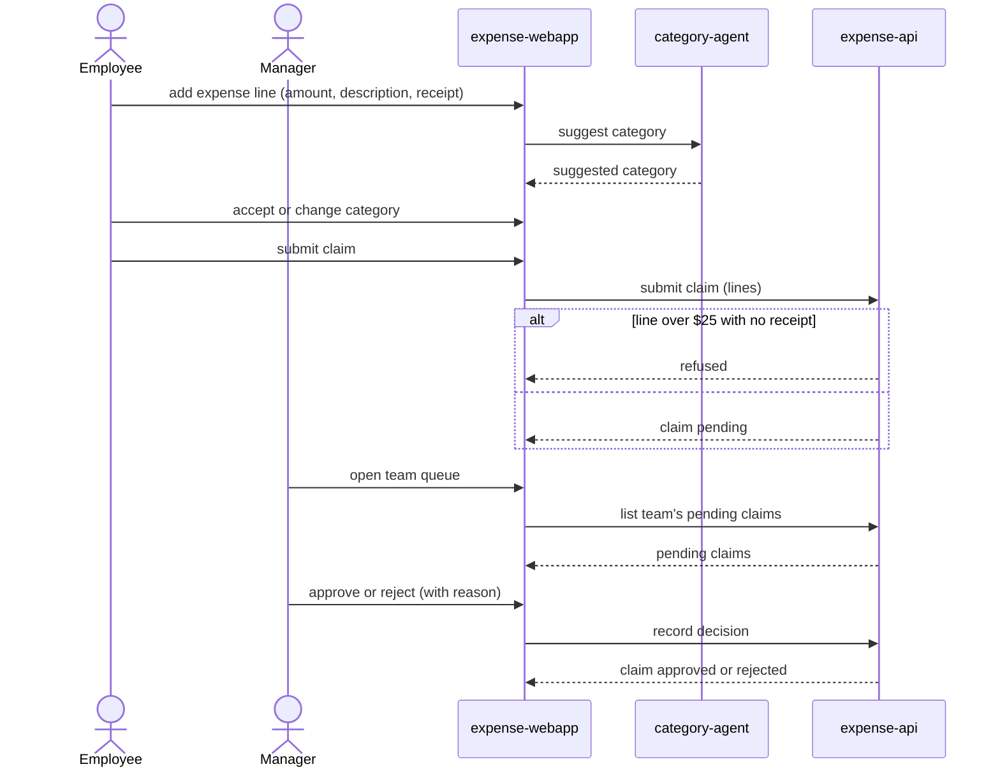

# Submit and approve a claim

An employee drafts a claim with an agent-suggested category, submits it, and their manager approves or rejects it.

```mermaid
sequenceDiagram
    actor Employee
    actor Manager
    participant expense-webapp
    participant category-agent
    participant expense-api

    Employee->>expense-webapp: add expense line (amount, description, receipt)
    expense-webapp->>category-agent: suggest category
    category-agent-->>expense-webapp: suggested category
    Employee->>expense-webapp: accept or change category
    Employee->>expense-webapp: submit claim
    expense-webapp->>expense-api: submit claim (lines)
    alt line over $25 with no receipt
        expense-api-->>expense-webapp: refused
    else
        expense-api-->>expense-webapp: claim pending
    end
    Manager->>expense-webapp: open team queue
    expense-webapp->>expense-api: list team's pending claims
    expense-api-->>expense-webapp: pending claims
    Manager->>expense-webapp: approve or reject (with reason)
    expense-webapp->>expense-api: record decision
    expense-api-->>expense-webapp: claim approved or rejected
```